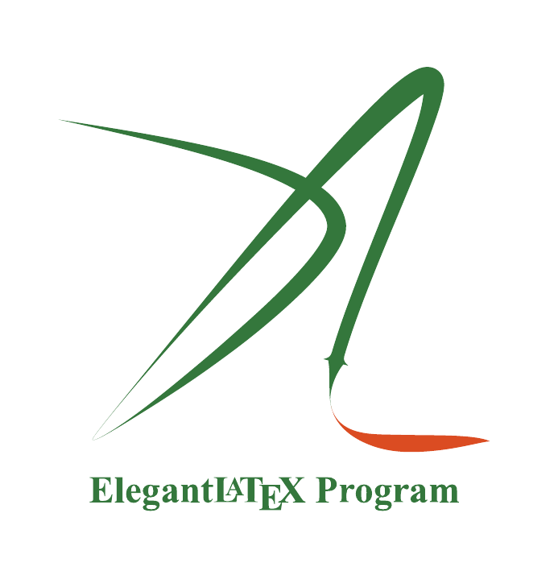

# ElegantLaTeX

The goal of ElegantLaTeX program is to design elegant, beautiful LaTeX templates. Now it consists of three templates.

+ [ElegantNote](https://github.com/ElegantLaTeX/ElegantNote): An Elegant LaTeX Template for Notes;
+ [ElegantBook](https://github.com/ElegantLaTeX/ElegantBook): An Elegant LaTeX Book Template;
+ [ElegantPaper](https://github.com/ElegantLaTeX/ElegantPaper): An Elegant LaTeX Template for Working Papers.

## links

+ Homepage: [https://elegantlatex.org/](https://elegantlatex.org/) 
+ Github Page: [https://github.com/ElegantLaTeX](https://github.com/ElegantLaTeX)
+ CTAN: 
    + [https://ctan.org/pkg/elegantpaper](https://ctan.org/pkg/elegantpaper)
+ Weibo: [https://weibo.com/elegantlatex](https://weibo.com/elegantlatex)

## Membership
We have 4 members, they are 

+ [Ethan Deng/ddswhu](https://github.com/orgs/ElegantLaTeX/people/EthanDeng);
+ [Liam Huang](https://github.com/orgs/ElegantLaTeX/people/Liam0205);
+ [peggy2006xzyz](https://github.com/orgs/ElegantLaTeX/people/peggy2006xzyz);
+ [Dishy Qming SU](https://github.com/orgs/ElegantLaTeX/people/franklinsu).

If you have any questions, you can create issues under corresponding template. For ElegantBook, it's [https://github.com/ElegantLaTeX/ElegantBook/issues](https://github.com/ElegantLaTeX/ElegantBook/issues).  Our email is also welcome: elegantlatex2e@gmail.com.

# ElegantLaTeX 

我们 ElegantLaTeX 创立于 2013 年，致力于设计优美的 LaTeX 模板，方便用户使用。目前有 3 套模板，分别是：

+ [ElegantNote](https://github.com/ElegantLaTeX/ElegantNote)：笔记模板；
+ [ElegantBook](https://github.com/ElegantLaTeX/ElegantBook)：书籍模板；
+ [ElegantPaper](https://github.com/ElegantLaTeX/ElegantPaper)：工作论文模板。

## 相关链接

+ 主页: [https://elegantlatex.org/](https://elegantlatex.org/) 
+ Github: [https://github.com/ElegantLaTeX](https://github.com/ElegantLaTeX)
+ CTAN: 
    + [https://ctan.org/pkg/elegantpaper](https://ctan.org/pkg/elegantpaper)
+ 微博: [https://weibo.com/elegantlatex](https://weibo.com/elegantlatex)

## 成员

目前我们有 4 名成员： 

+ [Ethan Deng/ddswhu](https://github.com/orgs/ElegantLaTeX/people/EthanDeng)；
+ [Liam Huang](https://github.com/orgs/ElegantLaTeX/people/Liam0205)；
+ [YPY](https://github.com/orgs/ElegantLaTeX/people/peggy2006xzyz)；
+ [Dishy Qming SU](https://github.com/orgs/ElegantLaTeX/people/franklinsu)。

如果你有其他问题，你可以在对应模板下的 issues 留言，比如 ElegantBook, 可以在 [https://github.com/ElegantLaTeX/ElegantBook/issues](https://github.com/ElegantLaTeX/ElegantBook/issues) 留下你的问题。我们也欢迎你给我们发邮件，我们的邮箱是 elegantlatex2e@gmail.com。
